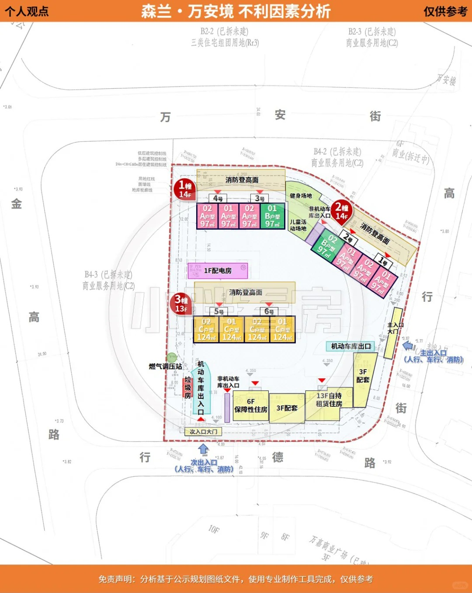
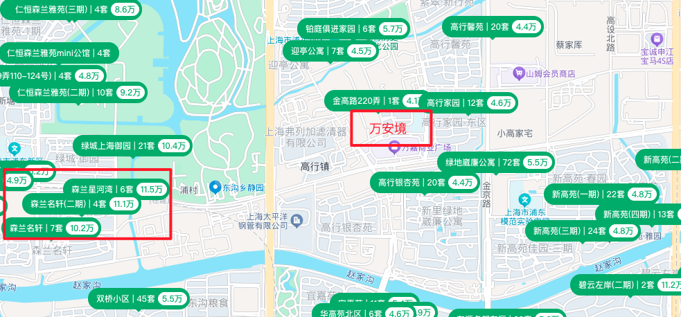

# 森兰万安境

## 基本信息

-   绿化 35%，容积率 1.7，车位比 1:1.1
-   1 期已经交付。万安里。
-   万安境是 2 期，最早明年 9 月交付。
-   3 期在建中，1 期对面，到时候主体工程会造完，不会太影响 2 期。
-   主力房型 97 平，套内面积 79.3，得房率 77。
-   B 户型还剩顶楼、2、3、4 楼，稍贵点，不多了。
-   A 户型还有 20 多，大概 700w。

## 交付标准

## 阳光遮挡

:::tip
1、3 号东南，2 号西南  
最好 9 楼以上，至少 7 楼。感觉 1 号楼好一些。
:::

-   春秋季:
    -   1#2#采光优异几乎不存在遮挡。3#低层受遮挡
    -   3#主要在上午受自持楼栋遮挡
-   冬季:
    -   1#2#中低层受遮挡。3#低层受遮挡
    -   1#主要在上午和中午受 3#遮挡。2#全天不同时段均会受到遮挡。3#主要在上午受自持楼栋遮挡
-   夏季:1#3#由于楼栋建筑朝向为东南偏转和夏季太阳角度河题，楼栋在下午处于阴影中,日照缺失,不过反而有利于减缓夏季西晒。
    -   2#由于楼栋建筑朝向为西南偏转和夏季太阳角度河题，楼栋上午处于阴影中,日照略有缺失
    -   2#西户受遮挡。就具体遮挡时间而言，2#主要在下午受 1#遮挡

## 地段

### 附近坐标型建筑

-   附近森兰绿地，直线 800 米
-   山姆，直线 750 米
-   2 期对面就是万嘉商业广场（看着像个老商区）。
-   远一点的：
    -   森兰印象城（已封顶，预计 2025 年 Q4 开业），2.4 公里，开车 8 分钟
    -   新嘉中心 Prisma（预计 2025 年底开业），3.4 公里，开车 9 分钟

### 交通

#### 公交

-   万嘉商业广场那边有公交站。
-   绿地有公交总站（五洲大道公交枢纽）。

:::warning
不怎么在意公交站，应该也不会用到。
:::

#### 地铁

-   右边 22 号线 1 期，1.6km。到崇明。
-   左边 6 号线五洲大道站，森兰绿地那边
-   下方 21、12 号线。 2km

:::warning
从地图看距离都差不多，走路的话其实有点距离。
:::

### 房价

-   森兰万安境房价 7w
-   周边房价 4w5-5w5。
-   2 公里外的「森兰名轩」价格 10w+

## 优缺点总结

-   优点：
    -   距离山姆 750 米。
    -   跟 1 期比，多了地暖，对面就是 万嘉商业广场。
-   缺点：
    -   但 1 期有河景，而且距离绿地近一点。1 期墙体外层是石材，2 期是涂料。
    -   没地铁没学区，只适合自驾居住舒适。
